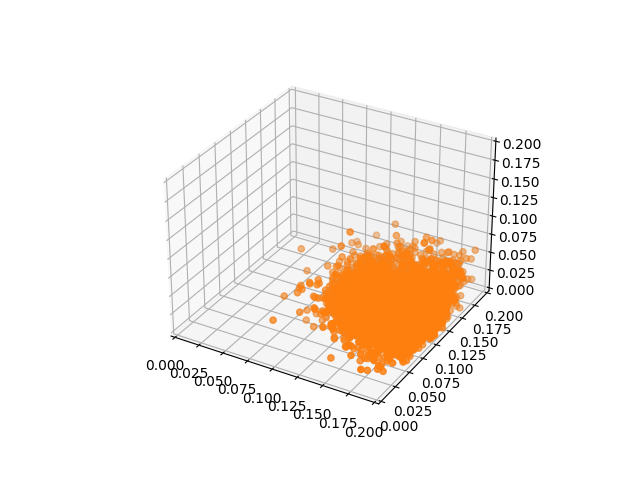

# Particle-Based-Fluid-Simulation

## Usage

You could compile code with `sh compile.sh` and modify parameters in `input.txt`, then execute following code:

```
./main input.txt data.bin
python3 SPH_painter.py data.bin
```




## TODO
- Fixing bugs in calculation: updating of Position & Velocity should be executed consistently.
- Adding JSON support.
- Adding 2D support.
- Adding multi thread support.


